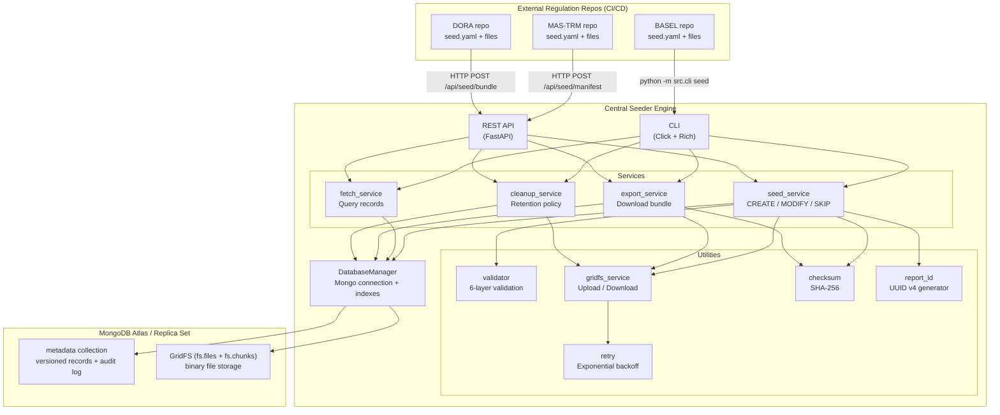
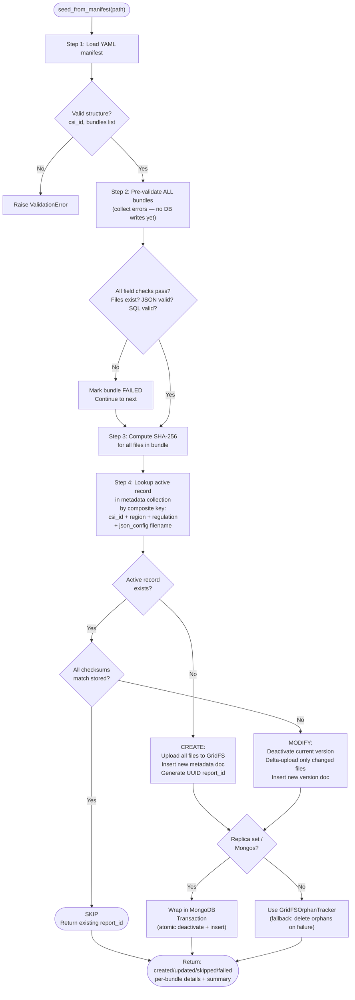
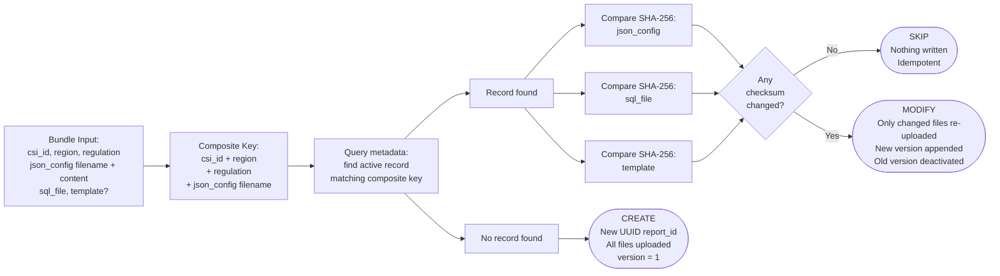
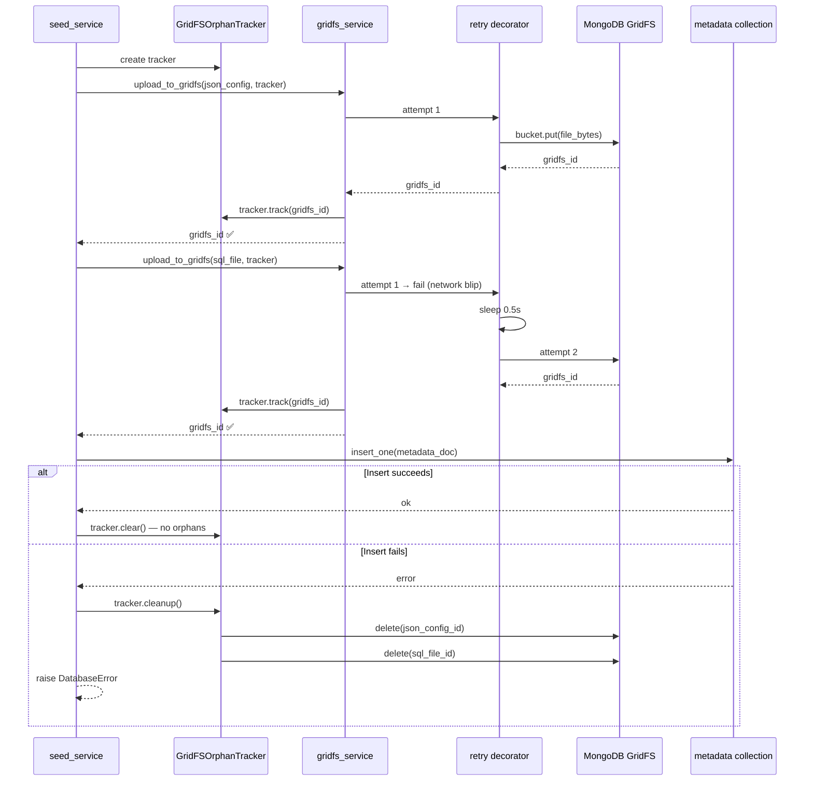
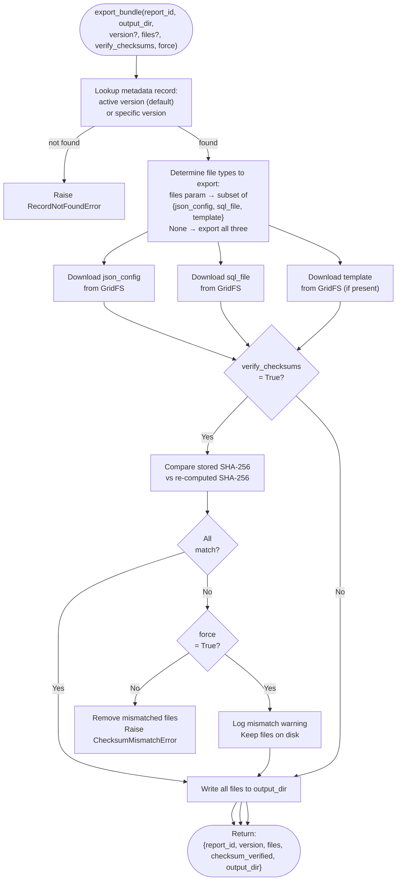
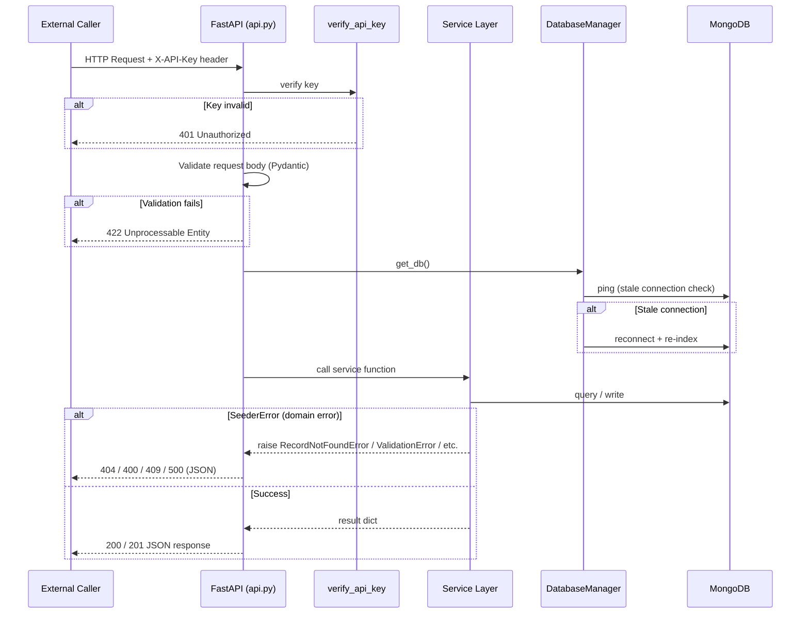
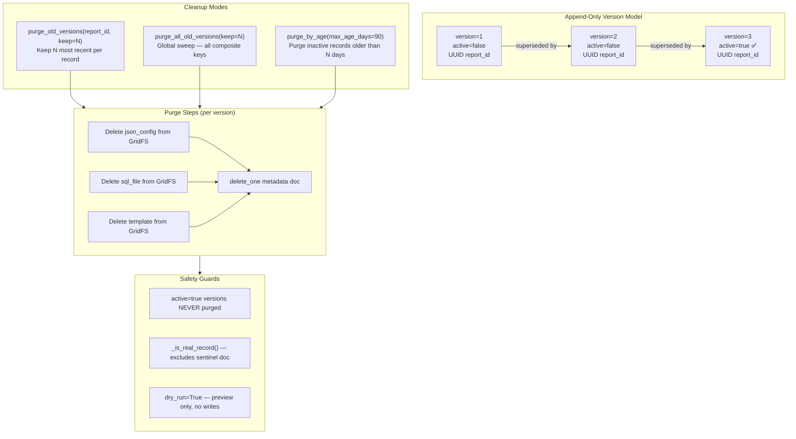
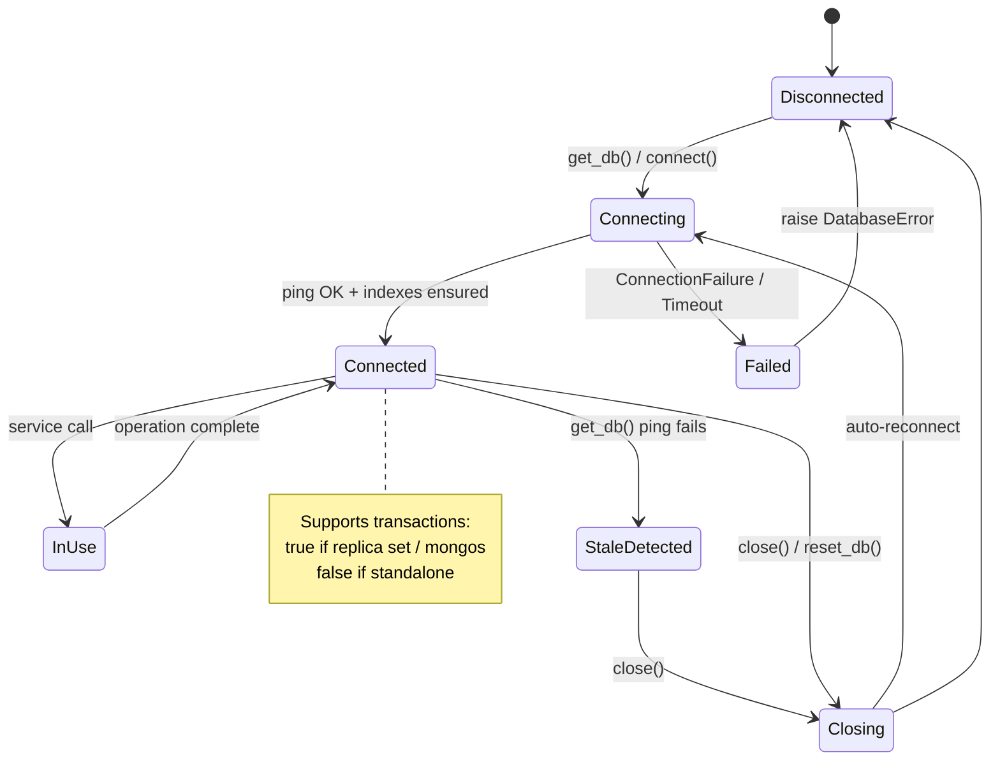
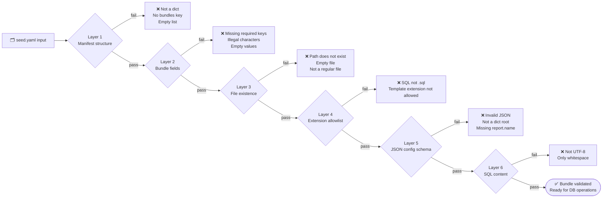
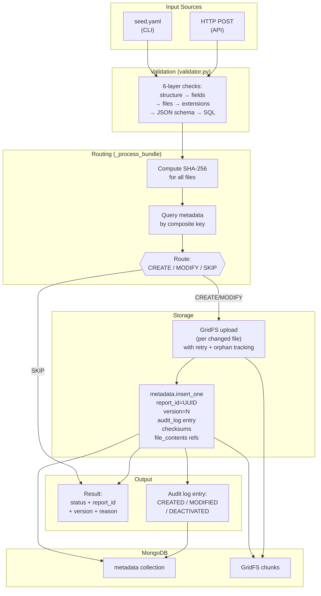

# MongoDB Document Seeder — Architecture & Flow Diagrams

All diagrams use [Mermaid](https://mermaid.js.org/) syntax and render natively in GitHub, GitLab, and Notion.

---

## 1. System Architecture

---

## 2. Seeding Flow — CREATE / MODIFY / SKIP

---

## 3. Composite Key Routing Logic

---

## 4. GridFS Upload with Retry & Orphan Tracking

---

## 5. Export Flow

---

## 6. API Request Lifecycle

---

## 7. Version History & Cleanup

---

## 8. Database Connection Lifecycle

---

## 9. Validation Pipeline

---

## 10. End-to-End Data Flow

