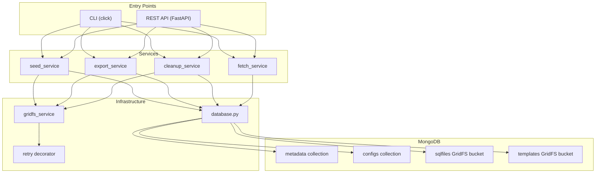
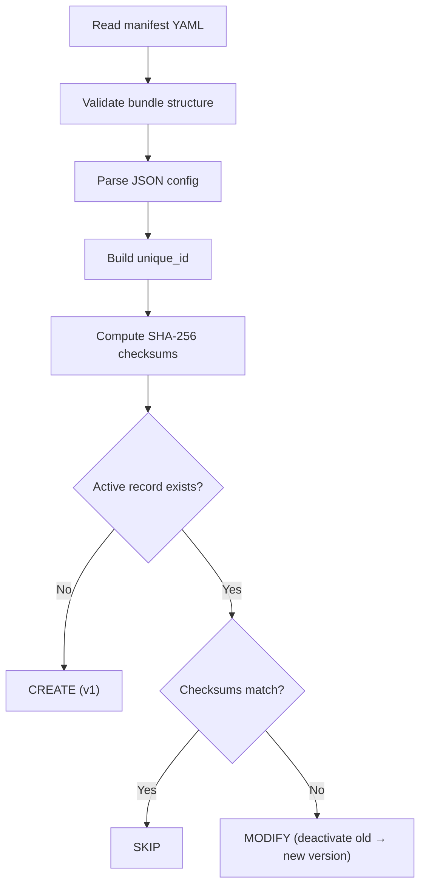
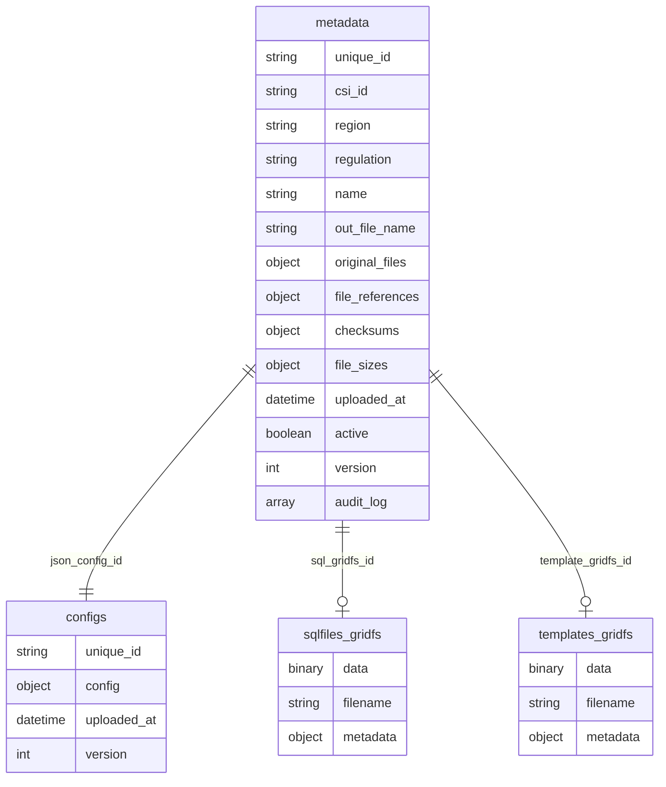
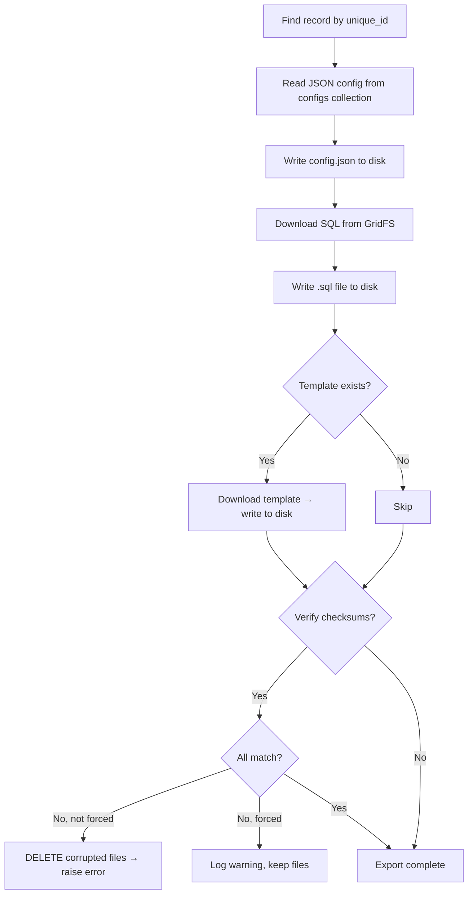

# MongoDB Document Seeder

A document bundle management system for regulatory documents. Stores versioned bundles of files (JSON configs, SQL queries, templates) in MongoDB with full **audit trails**, **SHA-256 checksums**, and **append-only versioning**.

---

## Quick Start

```bash
# 1. Install dependencies
pip install -r requirements.txt

# 2. Configure MongoDB connection
cp .env.example .env
# Edit .env with your MongoDB URI

# 3. Seed bundles from manifest
python -m src.cli seed seeds/seed.yaml

# 4. Or start the REST API
uvicorn src.api:app --reload --port 8000
```

### Environment Variables

```env
MONGO_URI=mongodb://localhost:27017
MONGO_DB_NAME=doc_management
LOG_LEVEL=INFO
API_KEY=              # leave empty to disable auth (dev mode)
```

---

## Project Structure

```
├── seeds/                     ← Source bundles to seed
│   ├── seed.yaml              ← Manifest listing all bundles
│   ├── configs/               ← JSON config files
│   ├── sql/                   ← SQL query files
│   └── templates/             ← Template files (optional)
├── src/
│   ├── cli.py                 ← CLI entry point (click + rich)
│   ├── api.py                 ← REST API (FastAPI)
│   ├── config/
│   │   └── database.py        ← MongoDB connection manager
│   ├── models/
│   │   └── schemas.py         ← Pydantic data models
│   ├── services/
│   │   ├── seed_service.py    ← Create & modify records
│   │   ├── fetch_service.py   ← Query records
│   │   ├── export_service.py  ← Export bundles to disk
│   │   ├── cleanup_service.py ← Purge old versions
│   │   ├── gridfs_service.py  ← GridFS file operations
│   │   └── audit_service.py   ← Audit log entries
│   ├── utils/
│   │   ├── checksum.py        ← SHA-256 hashing
│   │   ├── unique_id.py       ← Deterministic ID builder
│   │   ├── validator.py       ← Input validation
│   │   └── retry.py           ← Retry decorator with backoff
│   └── errors/
│       └── exceptions.py      ← Custom exception hierarchy
├── tests/unit/                ← Unit tests (pytest)
├── requirements.txt
└── .env.example
```

---

## Architecture



---

## How It Works

### 1. Database Connection

On startup, `DatabaseManager` connects to MongoDB, pings the server, and:

- **Detects transaction support** — checks if MongoDB is a replica set or standalone. If standalone, operations proceed without transactions (with a warning).
- **Creates indexes** — a partial unique index on `(unique_id)` where `active=true` ensures only one active record per bundle. Secondary indexes on `csi_id`, `region`, `regulation` for fast lookups.

### 2. Seeding Bundles

A **bundle** is a set of files that belong together:

| File Type | Storage | Example |
|-----------|---------|---------|
| JSON Config | `configs` collection (as a document) | Report metadata, schedule |
| SQL File | `sqlfiles` GridFS bucket (binary) | The query that generates data |
| Template | `templates` GridFS bucket (binary) | Report formatting template |

Prepare a `seed.yaml` manifest:

```yaml
bundles:
  - csi_id: "CSI-001"
    region: "APAC"
    regulation: "MAS-TRM"
    json_config: "configs/mas_trm_report.json"
    template: "templates/mas_trm_template.txt"
    sql_file: "sql/mas_trm_query.sql"
```

Run:
```bash
python -m src.cli seed seeds/seed.yaml
```

For each bundle, the seeder:

1. **Validates** the bundle keys and JSON config (must have `name` and `outFileName`)
2. **Builds a unique ID** from `regulation_name_outFileName_region` (normalized, lowercase)
3. **Computes SHA-256 checksums** for all files (once — reused throughout)
4. **Checks for existing active record:**
   - No existing → **CREATE** new record (version 1)
   - Exists but checksums match → **SKIP** (idempotent)
   - Exists but checksums differ → **MODIFY** (deactivate old, create new version)



### 3. Data Storage

| Storage | What | Why |
|---|---|---|
| `metadata` collection | Record metadata, version, checksums, file references, audit log | Fast queries, version tracking |
| `configs` collection | JSON config content as embedded documents | JSON is small, no need for GridFS |
| GridFS `sqlfiles` bucket | SQL files as binary blobs | Handles large files with chunking |
| GridFS `templates` bucket | Template files as binary blobs | Same reason |



### 4. Append-Only Versioning

When a bundle is modified, the old version is **deactivated** (`active: false`) and a new version is **appended**. Old versions are never deleted automatically — use the `cleanup` command to purge them.

If MongoDB supports transactions (replica set), the deactivation and new insert happen atomically. On standalone, operations run sequentially with orphan tracking.

### 5. Querying Records

| Function | CLI Command | What It Returns |
|----------|-------------|-----------------|
| `fetch_active_by_unique_id` | `fetch --unique-id X` | Single active record |
| `fetch_by_csi_id` | `fetch --csi-id X` | All records matching CSI ID |
| `fetch_by_region` | `fetch --region SG` | All records in a region |
| `fetch_by_regulation` | `fetch --regulation MAS-TRM` | All records for a regulation |
| `list_all_active` | `list` | Summary of all active records |
| `fetch_version_history` | `history --unique-id X` | All versions of a record |

All multi-result queries have a default limit of 500 to prevent memory issues.

### 6. Exporting Bundles

```bash
python -m src.cli export --unique-id "mas-trm_..." --output ./export_dir
```

Reconstructs original files from MongoDB/GridFS back to disk.



| Flag | Effect |
|------|--------|
| `--no-verify` | Skip checksum verification entirely |
| `--force` | Export files even if checksums don't match |
| (default) | Verify and abort on mismatch |

### 7. Cleanup (Retention)

```bash
python -m src.cli cleanup --all --keep 3 --dry-run
```

| Mode | Command | What It Does |
|------|---------|--------------|
| Per-record | `--unique-id X --keep 3` | Keep 3 most recent versions of one record |
| Global | `--all --keep 3` | Same, for every record |
| Age-based | `--max-age-days 90` | Delete inactive records older than 90 days |

> **Note:** Active records are **always protected** — they're never deleted regardless of `--keep` count. The `--dry-run` flag previews what would be deleted without actually deleting.

For each purged version, the system deletes:
- The metadata document
- The config document from `configs` collection
- The SQL file from GridFS
- The template file from GridFS (if any)

---

## Safety Mechanisms

### Checksum Verification
Every file gets a **SHA-256 checksum** computed at upload time and stored in the metadata. On export, checksums are re-verified to detect corruption.

### Retry with Exponential Backoff
GridFS operations are wrapped with `@retry_on_failure`. On transient errors (`AutoReconnect`, `ConnectionFailure`, `NetworkTimeout`), the operation retries up to 3 times with exponential delays (0.5s → 1s → 2s, capped at 10s).

### Orphan Cleanup
If a multi-step operation fails midway (e.g., SQL uploaded but metadata insert fails), the `GridFSOrphanTracker` cleans up all uploaded GridFS files **and** config documents:

```
upload SQL ✅ → upload template ✅ → insert metadata ❌
                                          ↓
                              tracker.cleanup() → deletes SQL, template & config doc
```

### Transaction Support
On replica sets, modify operations use MongoDB transactions for atomicity. On standalone instances, the system falls back to orphan tracking.

### API Authentication
The REST API supports `X-API-Key` header authentication. Set the `API_KEY` env var to enable it. When unset, auth is disabled (dev mode). All data endpoints require the key when enabled.

---

## CLI Commands

```bash
# Seed all bundles from manifest
python -m src.cli seed seeds/seed.yaml

# Create a single record
python -m src.cli create --csi-id CSI-003 --region US --regulation SOX \
  --config path/to/config.json --sql path/to/query.sql

# Modify an existing record
python -m src.cli modify --unique-id "sox_report_sox_output_us" --sql new_query.sql

# List active records
python -m src.cli list
python -m src.cli list --all    # include inactive

# Show version history
python -m src.cli history --unique-id "mas-trm_..."

# Fetch a specific record
python -m src.cli fetch --unique-id "..."
python -m src.cli fetch --region APAC
python -m src.cli fetch --csi-id CSI-001

# Export bundle files back to disk
python -m src.cli export --unique-id "..." -o ./exported/
python -m src.cli export --unique-id "..." -V 2 -o ./exported/       # specific version
python -m src.cli export --unique-id "..." -o ./exported/ --force     # ignore checksum failures
python -m src.cli export --unique-id "..." -o ./exported/ --no-verify # skip verification

# Cleanup old versions
python -m src.cli cleanup --unique-id "..." --keep 3 --dry-run
python -m src.cli cleanup --all --keep 3
python -m src.cli cleanup --max-age-days 90

# Verbose mode (debug logging)
python -m src.cli -v seed seeds/seed.yaml
```

---

## REST API

```bash
uvicorn src.api:app --reload --port 8000
```

| Method | Endpoint | Description |
|--------|----------|-------------|
| GET | `/api/health` | Health check + transaction support status |
| GET | `/api/records` | List records (filters: `region`, `csi_id`, `regulation`, `active_only`) |
| GET | `/api/records/{id}` | Fetch by unique_id (optional `?version=N`) |
| GET | `/api/records/{id}/history` | Full version history |
| GET | `/api/records/{id}/export` | Download bundle as ZIP |
| POST | `/api/cleanup` | Run retention cleanup (JSON body) |

All endpoints except `/api/health` require `X-API-Key` header when `API_KEY` is set.

---

## Running Tests

```bash
python -m pytest tests/unit -v
```

49 unit tests covering checksums, unique ID generation, validation, retry logic, and orphan tracking.
