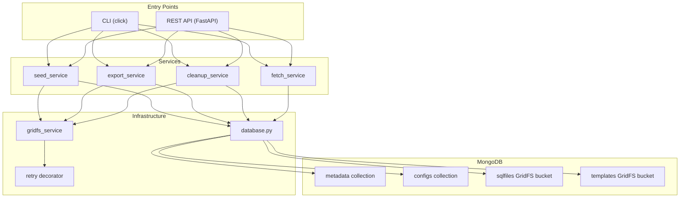
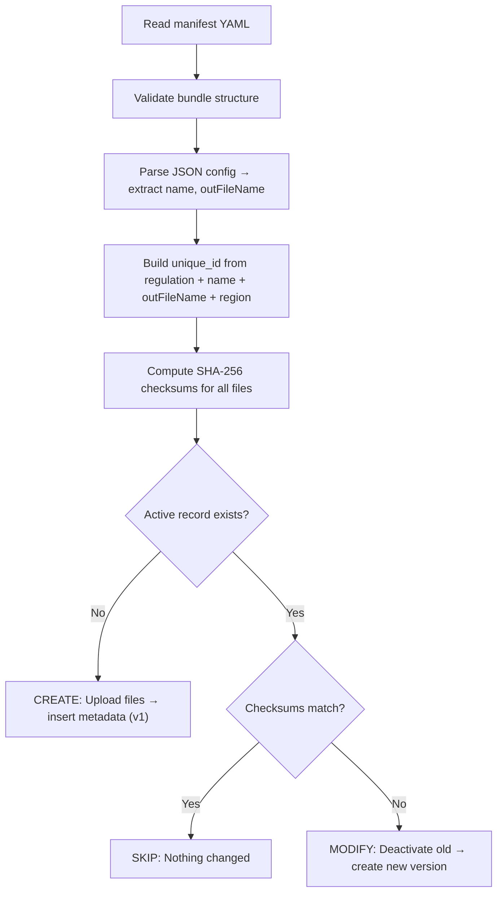
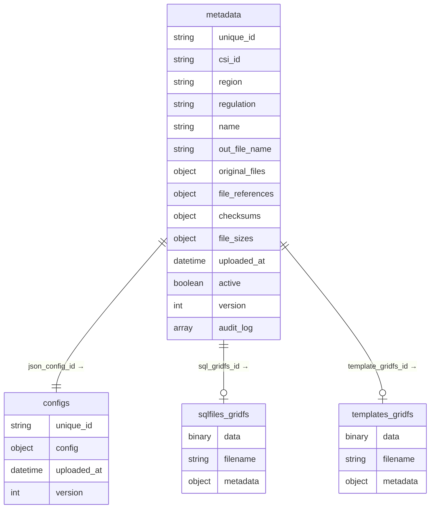
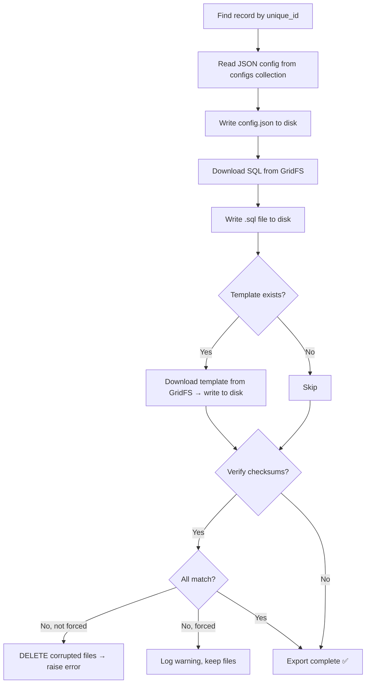

# MongoDB Document Seeder — Full Walkthrough

## What This Application Does

This is a **document bundle management system** for regulatory documents. It stores versioned bundles of files (JSON configs, SQL queries, templates) in MongoDB with full audit trails, checksum verification, and append-only versioning.

---

## Project Structure

```
Mongo/
├── seeds/                     ← Source bundles to seed
│   ├── seed.yaml              ← Manifest listing all bundles
│   ├── configs/               ← JSON config files
│   ├── sql/                   ← SQL query files
│   └── templates/             ← Template files (optional)
├── src/
│   ├── cli.py                 ← CLI entry point (click + rich)
│   ├── api.py                 ← REST API (FastAPI)
│   ├── config/
│   │   └── database.py        ← MongoDB connection manager
│   ├── models/
│   │   └── schemas.py         ← Pydantic data models
│   ├── services/
│   │   ├── seed_service.py    ← Create & modify records
│   │   ├── fetch_service.py   ← Query records
│   │   ├── export_service.py  ← Export bundles to disk
│   │   ├── cleanup_service.py ← Purge old versions
│   │   ├── gridfs_service.py  ← GridFS file operations
│   │   └── audit_service.py   ← Audit log entries
│   ├── utils/
│   │   ├── checksum.py        ← SHA-256 hashing
│   │   ├── unique_id.py       ← Deterministic ID builder
│   │   ├── validator.py       ← Input validation
│   │   └── retry.py           ← Retry decorator with backoff
│   └── errors/
│       └── exceptions.py      ← Custom exception hierarchy
├── tests/unit/                ← Unit tests (pytest)
├── requirements.txt
└── .env.example
```

---

## Architecture



---

## How It Works — Start to End

### Step 1: Database Connection

When any command runs, `database.py` creates a `DatabaseManager`:

1. Connects to MongoDB using `MONGO_URI` from `.env`
2. Pings the server to verify connectivity
3. **Detects transaction support** — checks if it's a replica set / mongos (transactions need replica sets)
4. Creates two **GridFS buckets**: `templates` and `sqlfiles`
5. Ensures indexes on `metadata` collection:
   - **Partial unique index** on `unique_id` where `active=True` (only one active record per ID)
   - Compound indexes for fast queries by `csi_id`, `region`, `regulation`

### Step 2: Seeding (Creating Records)

A **bundle** is a set of files that belong together:

| File Type | Storage | Example |
|-----------|---------|---------|
| JSON Config | `configs` collection (as a document) | Report metadata, schedule |
| SQL File | `sqlfiles` GridFS bucket (binary) | The query that generates data |
| Template | `templates` GridFS bucket (binary) | Report formatting template |

#### From a Manifest

```bash
python -m src.cli seed seeds/seed.yaml
```

The `seed.yaml` manifest lists bundles:

```yaml
bundles:
  - csi_id: "CSI-12345"
    region: "SG"
    regulation: "MAS-TRM"
    json_config: "configs/mas_trm_report.json"
    sql_file: "sql/mas_trm_query.sql"
    template: "templates/mas_trm_template.xlsx"
```

For each bundle, `seed_service.py` does:



#### The Unique ID

`unique_id.py` builds a deterministic ID by normalizing and concatenating:

```
regulation + name + outFileName + region
→ "mas-trm_mas_trm_compliance_report_mas_trm_report_sg"
```

This means re-seeding the same bundle always targets the same record — it's idempotent.

#### What Gets Stored in MongoDB



### Step 3: Versioning (Append-Only Modify)

When files change, the system **never** updates in place. Instead:

1. Old record → `active: false` + audit entry "DEACTIVATED"
2. Files re-uploaded to GridFS
3. New metadata record inserted with `version: N+1`, `active: true`
4. If on a replica set, this entire operation runs inside a **transaction**
5. If on standalone MongoDB, it runs without a transaction but with **orphan tracking**

> [!IMPORTANT]
> The `GridFSOrphanTracker` tracks every file uploaded during an operation. If the operation fails midway, all uploaded files (GridFS **and** config docs) are cleaned up automatically.

### Step 4: Querying Records

`fetch_service.py` provides query functions:

| Function | CLI Command | What It Returns |
|----------|-------------|-----------------|
| `fetch_active_by_unique_id` | `fetch --unique-id X` | Single active record |
| `fetch_by_csi_id` | `fetch --csi-id X` | All records matching CSI ID |
| `fetch_by_region` | `fetch --region SG` | All records in a region |
| `fetch_by_regulation` | `fetch --regulation MAS-TRM` | All records for a regulation |
| `list_all_active` | `list` | Summary of all active records |
| `fetch_version_history` | `history --unique-id X` | All versions of a record |

All multi-result queries have a default limit of 500 to prevent memory issues.

### Step 5: Exporting Bundles

```bash
python -m src.cli export --unique-id "mas-trm_..." --output ./export_dir
```

`export_service.py` reconstructs the original files:



| Flag | Effect |
|------|--------|
| `--no-verify` | Skip checksum verification entirely |
| `--force` | Export files even if checksums don't match |
| (default) | Verify and abort on mismatch |

### Step 6: Cleanup (Retention)

```bash
python -m src.cli cleanup --all --keep 3 --dry-run
```

`cleanup_service.py` manages storage growth:

| Mode | Command | What It Does |
|------|---------|--------------|
| Per-record | `--unique-id X --keep 3` | Keep 3 most recent versions of one record |
| Global | `--all --keep 3` | Same, for every record |
| Age-based | `--max-age-days 90` | Delete inactive records older than 90 days |

> [!IMPORTANT]
> Active records are **always protected** — they're never deleted regardless of `--keep` count. The `--dry-run` flag previews what would be deleted without actually deleting.

For each purged version, the system deletes:
- The metadata document
- The config document from `configs` collection
- The SQL file from GridFS
- The template file from GridFS (if any)

---

## Safety Mechanisms

### Checksum Verification
Every file gets a **SHA-256 checksum** computed at upload time and stored in the metadata. On export, checksums are re-verified to detect corruption.

### Retry with Exponential Backoff
`retry.py` wraps GridFS operations with automatic retries for transient MongoDB errors (`AutoReconnect`, `ConnectionFailure`, `NetworkTimeout`). Default: 3 retries with exponential backoff.

### Orphan Cleanup
If a multi-step operation fails midway (e.g., SQL uploaded but metadata insert fails), the `GridFSOrphanTracker` cleans up all uploaded files **and** config documents.

### Transaction Support
On replica sets, modify operations use MongoDB transactions for atomicity. On standalone instances, the system falls back to orphan tracking.

### API Authentication
The REST API supports `X-API-Key` header authentication. Set the `API_KEY` env var to enable it. When unset, auth is disabled (dev mode).

---

## CLI Commands Reference

```bash
# Seed from manifest
python -m src.cli seed seeds/seed.yaml

# Create a single record
python -m src.cli create --csi-id CSI-123 --region SG --regulation MAS-TRM \
    --config configs/report.json --sql sql/query.sql --template templates/tmpl.xlsx

# Modify an existing record
python -m src.cli modify --unique-id "mas-trm_..." --sql sql/updated_query.sql

# List all active records
python -m src.cli list
python -m src.cli list --all    # include inactive

# Fetch by key
python -m src.cli fetch --unique-id "mas-trm_..."
python -m src.cli fetch --region SG

# Version history
python -m src.cli history --unique-id "mas-trm_..."

# Export bundle to disk
python -m src.cli export --unique-id "mas-trm_..." -o ./exported
python -m src.cli export --unique-id "mas-trm_..." -o ./exported --force

# Cleanup old versions
python -m src.cli cleanup --unique-id "mas-trm_..." --keep 3
python -m src.cli cleanup --all --keep 3 --dry-run
python -m src.cli cleanup --max-age-days 90
```

## REST API Endpoints

| Method | Endpoint | Description |
|--------|----------|-------------|
| GET | `/api/health` | Health check + transaction support status |
| GET | `/api/records` | List records with pagination and filters |
| GET | `/api/records/{id}` | Get single record (optionally by version) |
| GET | `/api/records/{id}/history` | Full version history |
| GET | `/api/records/{id}/export` | Download bundle as ZIP |
| POST | `/api/cleanup` | Trigger cleanup (version/age-based) |

Start the API:
```bash
uvicorn src.api:app --reload
```

All endpoints except `/api/health` require `X-API-Key` header when `API_KEY` is set.
